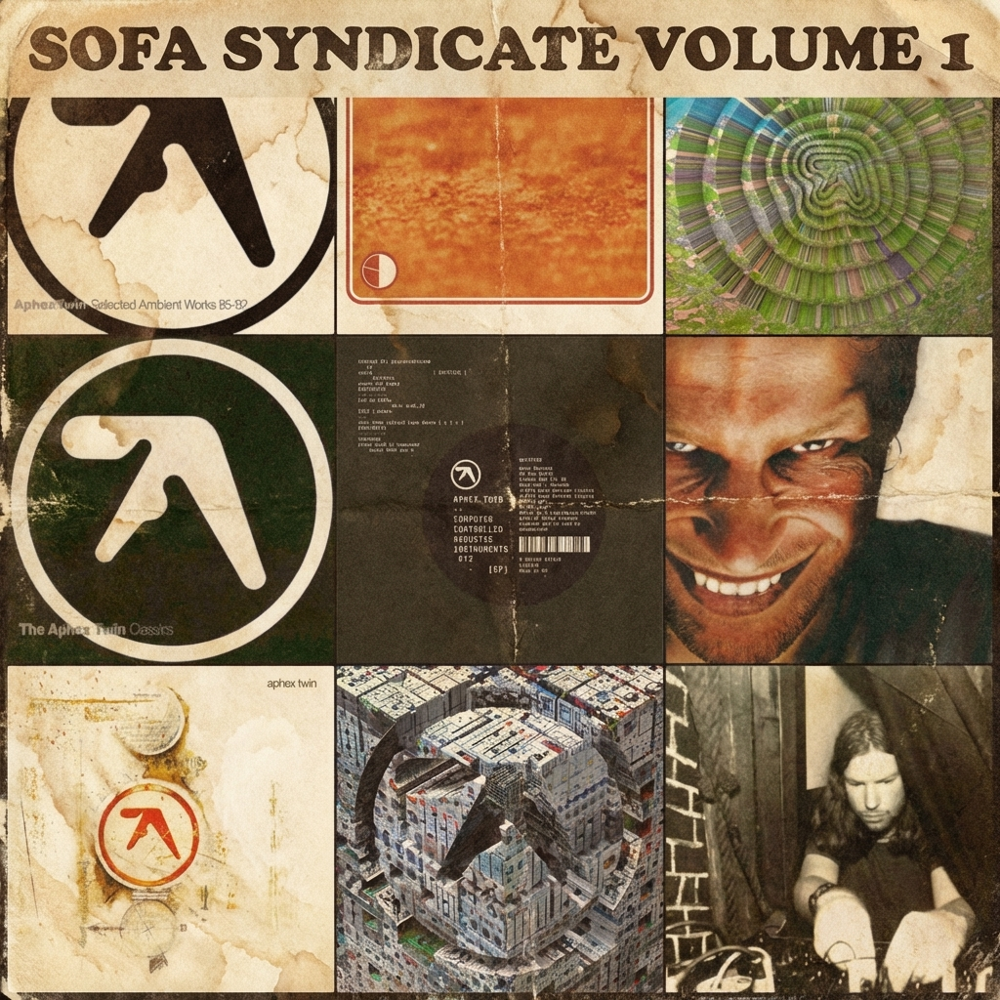

# WhiteLabel

> [!TIP]
> Application is deployed to https://www.jesseward.com/whitelabel . If you wish to use Discogs or LastFM API you will need to supply your own keys. The application is a static page hosted on GitHub pages. Keys are stored in your browser session only and only used during the tranmission of the API request..

WhiteLabel is a client-side web application allowing you to create mosciacs from album art. You can optionally apply effects using Gemini's Nano Banana model, for example ..

## Features

- **Multi-Provider Search**: Fetch album alrt from sources :  Last.fm, Discogs, MusicBrainz, and Apple iTunes.
- **Batch Import**: Upload text files to automatically populate your crate with random selections from a playlist.
- **Client-Side Configuration**: "Bring Your Own Key" allows users to input API keys directly in the UI, enabling purely static hosting.
- **AI Lab**: Style transfers and custom typography powered by Gemini Nano Banana.

## Documentation

For detailed information on configuration, search filters, and AI features, see the [User Guide](docs/HOWTO.md).

## How

This tool was written using Gemini flash-3-preview model.
